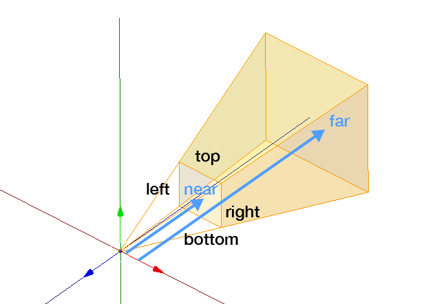

# three.jsを使ってみる(1)
だんじりと太鼓台の3Dモデルを作成した(blender)のでJavaScriptのライブラリであるThree.jsを用いて3Dモデルをwebページに表示させる　　
## はじめに　　

## 1 scene camera rendererについて
- scene(舞台)オブジェクト   
    表示したい全ての物体光源を保持して変更を監視するコンテナオブジェクト  
    シーンという名前の通りの機能である
    ```
    //scene オブジェクトを作成する
    scene = new THREE.Scene();
    ```
- camera(カメラ)オブジェクト  
    シーンが描画する時に何が見えるか決定　
    ```
    // 1−2 camera オブジェクト作成する
    camera = new THREE.PerspectiveCamera(45, window.innerWidth / window.innerHeight, 0.1, 1000);
    ```
    **PerspectiveCamera・・・奥行きを見渡せる遠近法のカメラ**
    ```
    camera = new THREE.PerspectiveCamera(fov, aspect, near, far);
    ```
    fav・・・視野角  
    aspect・・・画面サイズ  
    near・・・カメラが見える範囲最小値  
    far・・・カメラが見える範囲最大値  
    


-  rendererオブジェクト  
    cameraオブジェクトの角度に基づいてブラウザ内でsceneオブジェクトがどのように見えるのかを計算   
    ```
    // 1−3 renderer オブジェクトを作成する
    renderer = new THREE.WebGLRenderer();
    renderer.setClearColor(new THREE.Color(0xEEEEEE));
    renderer.setSize(window.innerWidth, window.innerHeight);
    ```
    仮想的な3D空間における物体を2Dのディスプレイに適切に描画するためのもの   
## 2 座標と平面の追加  
- *平面*  
平面を追加するためにどのような平面(幅、高さ)であるか
    ```
    //平面を作成する PlaneGeometry=平面幾何学
    var planeGeometry = new THREE.PlaneGeometry(60, 20);
    var planeMaterial = new THREE.MeshLambertMaterial({color: 0xffffff});
    var plane = new THREE.Mesh(planeGeometry, planeMaterial);
    ```

